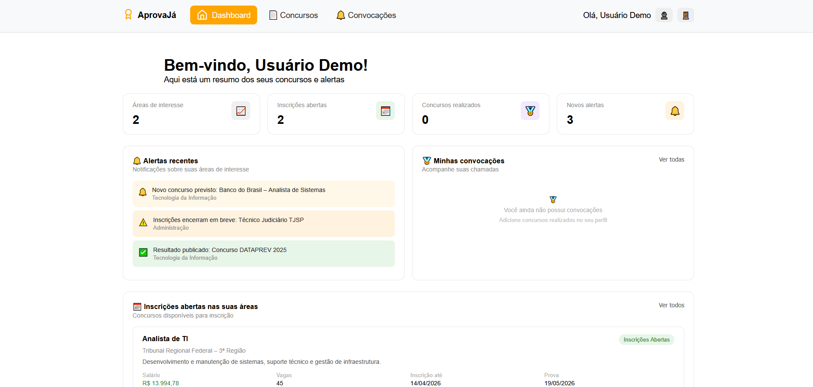

## 📋 CC Projeto Concursos

Aplicação web para visualizar concursos públicos abertos.  
O usuário acessa a página e visualiza uma listagem de concursos disponíveis, com dados simulados fornecidos pela API JSONPlaceholder.

## 🚀 Funcionalidades

- Listagem de concursos abertos
- Consumo de dados via API
- Feedback visual de carregamento e erros

## 🛠️ Tecnologias Utilizadas

- HTML5
- CSS3
- JavaScript
- [JSONPlaceholder API](https://jsonplaceholder.typicode.com/)

## 📸 Demonstração

## 📌 Objetivo do Projeto

Este projeto foi desenvolvido com o objetivo de praticar:

- Consumo de APIs com `fetch`
- Manipulação de DOM
- Tratamento de erros assíncronos com `try/catch`
- Estruturação de projetos front-end

## 👨‍💻 Autores

Desenvolvido por:
[E-Danillo](https://github.com/E-Danillo) 
[Gisele](https://github.com/Gisele0304)
[Ricardo](https://github.com/RicardoPCBrito)
[Gydeon](https://github.com/gydwxd)
[Neto](https://github.com/8qst6js4vv-commits)